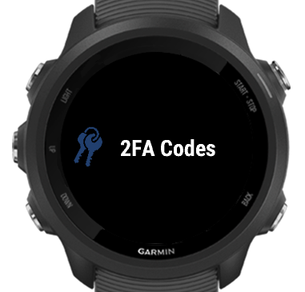
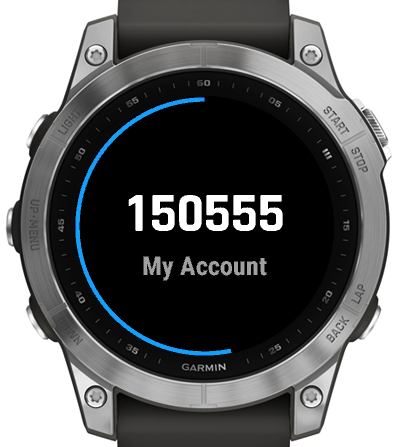

# HOTP Code Generator for Garmin - [Connect IQ Store Page](https://apps.garmin.com/apps/b3ae41f2-3710-4368-a365-4d1ba1b3770c)

This is a widget to generate HOTP and TOTP 2FA codes on Garmin devices. It works with DUO security, Google Authenticator, and similar 2fa code solutions.

### Usage

The app supports both Time-based OTP (TOTP) and HMAC-based OTP (HOTP):

- **TOTP** accounts automatically refresh every 30 seconds (or configured time step) and show a countdown timer
- **HOTP** accounts require manual generation of the next code by tapping the screen or using the select button when viewing the account

For HOTP accounts, the current counter value is maintained and automatically incremented each time a new code is generated. The counter persists between app sessions.

 

**Why not always show auth code in glances?**

Garmin devices support two ways of showing widget glances, for a devices that have enough resources, the glances can be updated every second. That works perfectly for TOTP accounts as the current 2FA code can be shown and updated as necessary along with the countdown bar that shows time till the code change.

For HOTP accounts, glances will show the last generated code, but new codes must be generated manually by opening the main widget.

Devices that have less resources will give an application a change to update the glance only once. There is no way to know when the glance could be updated next time. The only guarantee is that will not happen in the next 30 seconds. Given than most (if not all) TOTP codes have a time window of 30 seconds there are good chances that the code displayed in the widget glance is out of date by the time you use it to authenticate. For HOTP accounts, the displayed code remains valid until the next code is generated. It might work, depending on the authentication server status, but it is way more reliable just to open the full widget and have up to date code displayed along with countdown timer (for TOTP) or manual generation (for HOTP).

## Compatibility

HOTP Codes should run on any Garmin watch supporting Connect IQ version 3.1 or higher.

# License

The source code is released under the [MIT license](license.md)
